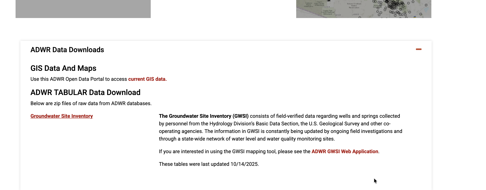

# ArizonaGroundWaterETL

This repository generates a postgis datadump for the ADWR TABULAR Data Download. It puts it in a database schema that can be used with pgedr to serve the items using the OGC Environmental Data Retrieval Standard (EDR) 
 
To download the source dataset you must go to https://www.azwater.gov/gis-data-and-maps and download the ADWR Tabular Data Download 

