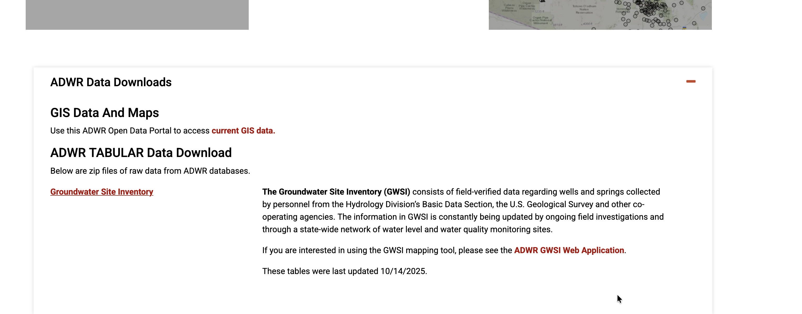

# ArizonaGroundWaterETL

This repository generates a postgis datadump for the ADWR TABULAR Data Download. It puts it in a database schema that can be used with pgedr to serve the items using the OGC Environmental Data Retrieval Standard (EDR) 
 
To download the source dataset you must go to https://www.azwater.gov/gis-data-and-maps and download the ADWR Tabular Data Download 

## Retrieving the Data

Run `docker pull ghcr.io/cgs-earth/arizona-groundwater-dump:latest` and look for the `edr_backup.edr` file that will be created.

## Generating

To generate the data dump you should run the `make gen` command in the makefile. You must ensure that postgis is running.

Then run `oras push ghcr.io/cgs-earth/arizona-groundwater-dump:latest edr_backup.dump:application/octet-stream --username internetofwater --password ${PERSONAL_ACCESS_TOKEN}` 

# Wells 55

To get the info for the well name and description you need to join the ID in the xlsx files with the REGISTRY_ID field in https://services.arcgis.com/C34zQ7veRS0V1t04/ArcGIS/rest/services/Well_Registry_2024/FeatureServer/0 